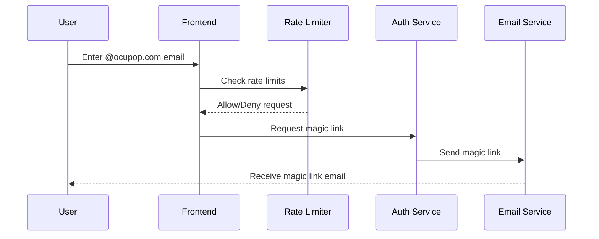
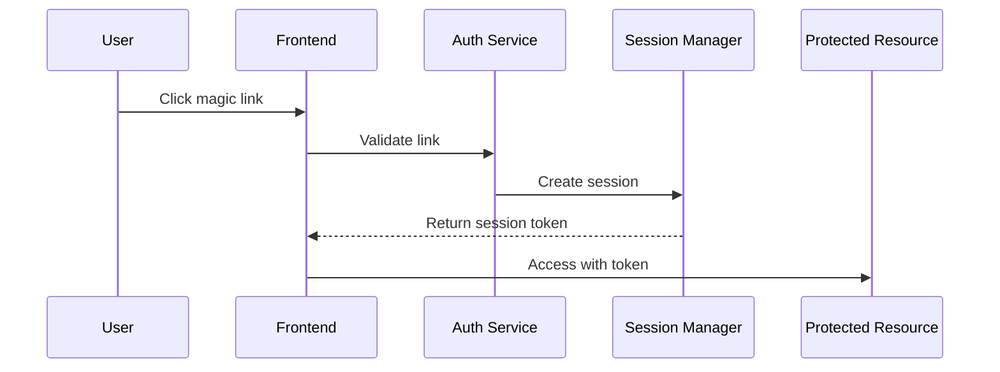

# Authentication Flow Documentation

## Overview
This document describes the passwordless authentication flow implemented for Flowise instances on both AWS and GCP platforms. The system is designed to provide secure, domain-restricted access exclusively for @ocupop.com email addresses.

## Authentication Flow

### 1. Initial Authentication Request


### 2. Magic Link Authentication


## Security Features

### 1. Rate Limiting
- Maximum 5 attempts per 15-minute window
- Rate limits applied per email and IP address
- 60-minute lockout after exceeding limits
- Automatic cleanup of expired rate limit records

### 2. Session Management
- Session duration: 1 hour
- Inactivity timeout: 15 minutes
- Single-use magic links
- Device fingerprinting
- Automatic session cleanup

### 3. Domain Restriction
- Only @ocupop.com email addresses allowed
- Email domain validation before magic link generation
- Prevents email spoofing attempts

## Monitoring and Alerts

### AWS Monitoring
1. CloudWatch Metrics:
   - Authentication successes/failures
   - Rate limit violations
   - Session creation/termination
   - Magic link generation/usage

2. Alerts:
   - High authentication failure rate
   - Rate limit threshold exceeded
   - Suspicious IP activity
   - Session anomalies

### GCP Monitoring
1. Cloud Monitoring Metrics:
   - Authentication attempts
   - Rate limiting events
   - Function invocations
   - Error rates

2. Alerts:
   - Authentication failures
   - Rate limit violations
   - Resource utilization
   - Security events

## Email Templates

### Magic Link Email
- Branded Ocupop design
- Security information
- Device and location details
- Clear call-to-action button
- Session expiry notice

## Error Handling

### Common Error Scenarios
1. Rate Limit Exceeded:
   ```json
   {
     "error": "Rate limit exceeded",
     "retryAfter": 3600,
     "code": "RATE_LIMIT_EXCEEDED"
   }
   ```

2. Invalid Domain:
   ```json
   {
     "error": "Invalid email domain",
     "code": "INVALID_DOMAIN"
   }
   ```

3. Expired Magic Link:
   ```json
   {
     "error": "Link expired",
     "code": "LINK_EXPIRED"
   }
   ```

## Best Practices

### Security
1. Never store sensitive information in logs
2. Implement proper error handling
3. Use secure communication channels
4. Regular security audits
5. Monitor for suspicious activities

### Performance
1. Optimize database queries
2. Implement caching where appropriate
3. Use appropriate timeout values
4. Monitor resource utilization

## Deployment

### AWS Deployment
```hcl
module "flowise_auth" {
  source = "./aws"
  
  project_name    = "flowise"
  domain_name     = "flowise.ocupop.com"
  alert_email     = "admin@ocupop.com"
  ocupop_logo_url = "https://ocupop.com/assets/logo.png"
}
```

### GCP Deployment
```hcl
module "flowise_auth" {
  source = "./gcp"
  
  project_id      = "your-project-id"
  project_name    = "flowise"
  domain_name     = "flowise.ocupop.com"
  alert_email     = "admin@ocupop.com"
  ocupop_logo_url = "https://ocupop.com/assets/logo.png"
}
```

## Troubleshooting

### Common Issues
1. Rate Limit Issues:
   - Check rate limit counters
   - Verify IP address detection
   - Review lockout duration

2. Session Problems:
   - Verify session token validity
   - Check session duration settings
   - Review inactivity timeout

3. Email Delivery:
   - Check SMTP configuration
   - Verify email templates
   - Monitor email delivery logs

## Support and Maintenance

### Monitoring Dashboards
- Authentication success/failure rates
- Rate limiting metrics
- Session statistics
- Resource utilization

### Logging
- Structured logging format
- Separate security events
- Regular log rotation
- Audit trail maintenance
